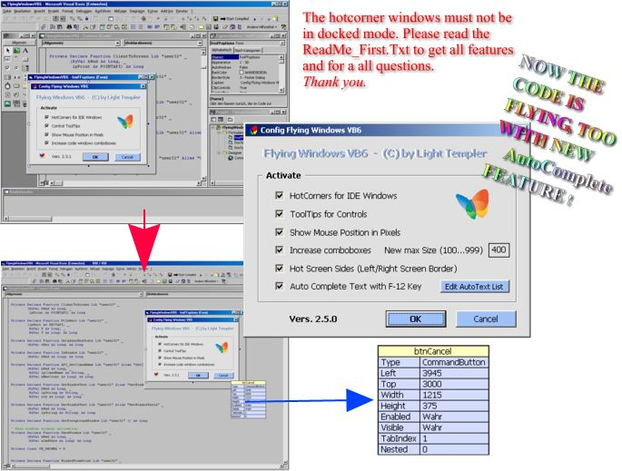



## FlyingWindows \- An AddIn by Light Templer \- NEW VERSION 2\.5\.0 from 10/20/2004  NOW WITH AUTOCOMPLETE

### Description

Flying Windows claims fully back the valuable work area of your IDE! No unneeded tool or property

window is open when writing code or designing a form. Now the whole screen belongs to you to design

your form or write some code! And when you need a tool/property window: One quick move (no mouseclick!)

of your mouse is enough to get it back / take it away.

___ 2nd hilite: Small property windows for controls like the known tooltips are assisting your form design!

___ And some more nice gimmicks...

----

Advertisement stop. ;) - To the facts:

Implemented in Flying Windows so far

* Hotcorners for most used tool windows (toolbox, properties, project

explorer and immediate window)

* Empty the immediate window when ctrl key is pressed on opening by hotcorner.

* Tooltip windows for controls showing the name and the most important properties.

* Click on a property value in the tooltip window with ctrl key pressed puts this

value into the clipboard.

* Tooltip windows are moveable by caption bar. Leave them open with ctrl key pressed

when mouse leaves tooltip window. Close them with a simple mouseclick.

* Show mouse pointers absolut screen coordinates in VB IDEs title bar in pixel.

* With an open source code pane moving the mouse to the left border of the screen

opens the coresponding designer window (Shift-F7) and reverse.

* The size of comboboxes of a code pane are increased to show much more values

without a need for boring scrolling. 

----

Background: To do all of this I had to dig very deep into VB IDEs COM interface and so here is hard stuff like 'Get a reference to the control under the mouse' and more ... 

----

Enjoy the new feeling in programming VB! 

----

Regards LiTe

----

NEW VERSION 2.5.0 - 10/20/2004: Now your code is flying, too! I have added a powerfull TEXT AUTOCOMPLETE feature to speedup your coding. Please read ReadMe_First.Txt or code header for details.

----

Thx for your comments and votes - they show me that you see the 160 hours which are in this tool now.
 
### More Info
 

             |
---                |---
**Submitted On**   |2004-10-17 15:45:00
**By**             |[Light Templer](https://github.com/Planet-Source-Code/PSCIndex/blob/master/ByAuthor/light-templer.md)
**Level**          |Advanced
**User Rating**    |4.8 (203 globes from 42 users)
**Compatibility**  |VB 6\.0
**Category**       |[OLE/ COM/ DCOM/ Active\-X](https://github.com/Planet-Source-Code/PSCIndex/blob/master/ByCategory/ole-com-dcom-active-x__1-29.md)
**World**          |[Visual Basic](https://github.com/Planet-Source-Code/PSCIndex/blob/master/ByWorld/visual-basic.md)
**Archive File**   |[FlyingWind18082610202004\.zip](https://github.com/Planet-Source-Code/light-templer-flyingwindows-an-addin-by-light-templer-new-version-2-5-0-from-10-20-2004-no__1-56516/archive/master.zip)

